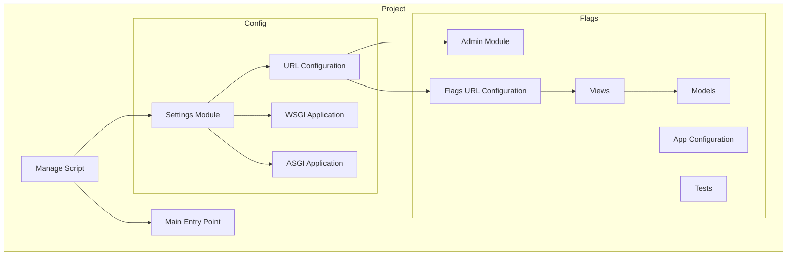

    

    <b>Automatic Architecture Diagrams from Code</b> 
    <a href="https://github.com/swark-io/swark">GitHub</a> • <a href="https://swark.io">Website</a> • <a href="mailto:contact@swark.io">Contact Us</a>

## Usage Instructions

1. **Render the Diagram**: Use the links below to open it in Mermaid Live Editor, or install the [Mermaid Support](https://marketplace.visualstudio.com/items?itemName=bierner.markdown-mermaid) extension.
2. **Recommended Model**: If available for you, use `claude-3.5-sonnet` [language model](vscode://settings/swark.languageModel). It can process more files and generates better diagrams.
3. **Iterate for Best Results**: Language models are non-deterministic. Generate the diagram multiple times and choose the best result.

## Generated Content
**Model**: GPT-4o - [Change Model](vscode://settings/swark.languageModel)  
**Mermaid Live Editor**: [View](https://mermaid.live/view#pako:eNqFUstOwzAQ_BXL5_YHckCqKCAkIlWkwMGukEk2jlFiR35QVVX_HT-aloYUclg7M-PdnbX3uFQV4AxTyTXrG7ReUon8Z9xHAlZafUJpE3rB3CpZC34mIgnWCskNKY4blKvKtbC5lDndGvLy_HTM4TSzQsmRaGu4IG_FwyNa9H0ryikNC5rFdQ3IaqLz-5ZxM0pUdUKSRYjTLbO-N8QX-bPl4Ou9DtlJrIH-8_glYGvIa4gjpvP34oeUx2XEWTDWkHWI17x2TDIOJI8LKkoterv5SXu3uQ_oTlq9Qysl5MDHPMdXMNzifH4TzU3A4ZomYHaCw7lTgjSdERGHf8aSJjJxPomJ2wim0SQ0-YzwUP4XEcxSiWe4A-33lX_ue4ptAx1QnCGKK6iZay3FBy9yfcUsLAXzb6XDmdUOZpg5q4qdLId_rRxvcFaz1sDhG6llAkw) | [Edit](https://mermaid.live/edit#pako:eNqFUstOwzAQ_BXL5_YHckCqKCAkIlWkwMGukEk2jlFiR35QVVX_HT-aloYUclg7M-PdnbX3uFQV4AxTyTXrG7ReUon8Z9xHAlZafUJpE3rB3CpZC34mIgnWCskNKY4blKvKtbC5lDndGvLy_HTM4TSzQsmRaGu4IG_FwyNa9H0ryikNC5rFdQ3IaqLz-5ZxM0pUdUKSRYjTLbO-N8QX-bPl4Ou9DtlJrIH-8_glYGvIa4gjpvP34oeUx2XEWTDWkHWI17x2TDIOJI8LKkoterv5SXu3uQ_oTlq9Qysl5MDHPMdXMNzifH4TzU3A4ZomYHaCw7lTgjSdERGHf8aSJjJxPomJ2wim0SQ0-YzwUP4XEcxSiWe4A-33lX_ue4ptAx1QnCGKK6iZay3FBy9yfcUsLAXzb6XDmdUOZpg5q4qdLId_rRxvcFaz1sDhG6llAkw)

